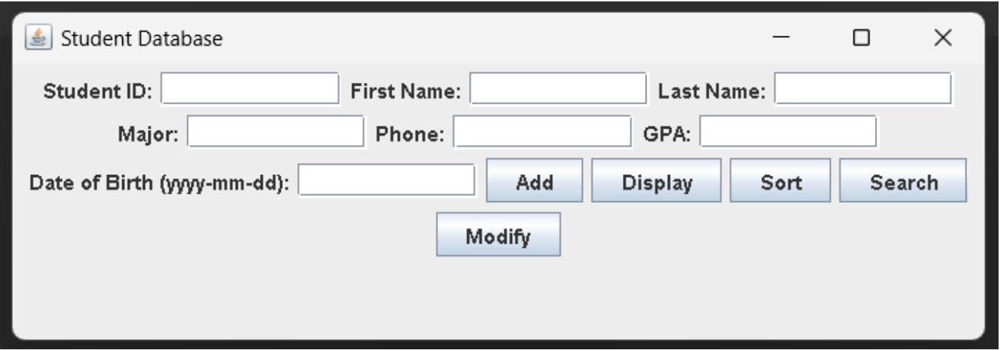
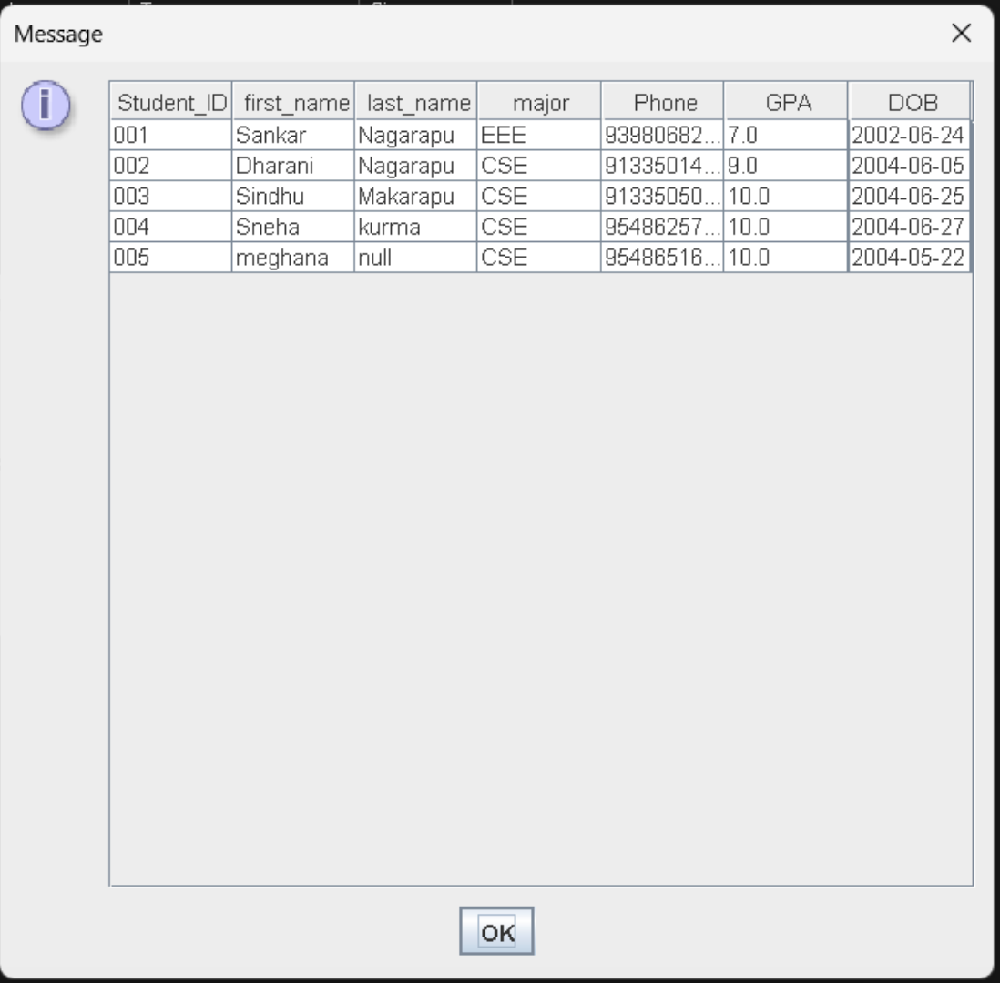
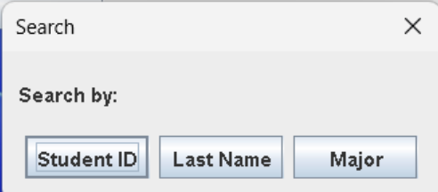
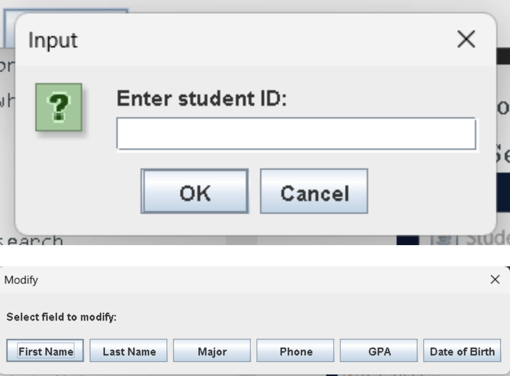

# Student Management System (Java + MySQL)

## 📘 Project Title
**Student Management System**

## 📄 Overview of the Project
This project is a simple Student Management System developed using **Java (Swing GUI)** and **MySQL**.  
It allows users to manage student information through the following operations:

- Add new students  
- View all students  
- Search students by ID, Last Name, or Major  
- Sort students by First Name, Last Name, or Major  
- Modify existing student details  

The system uses JDBC to connect Java and MySQL, and displays records using JTable.

---

## 🛠️ Technologies / Tools Used
- **Java 8+**
- **Java Swing (GUI)**
- **MySQL Database**
- **JDBC Driver (MySQL Connector JAR)**
- **VS Code / IntelliJ / Eclipse**
- **Git & GitHub (optional)**

---

## 🚀 Steps to Install & Run the Project

### **1. Clone the repository**

https://github.com/DebTheDevV/Java_project_24BCE110579.git

### **2. Import the SQL file**
Make sure MySQL is installed, then run:

mysql -u root -p studata < student_data.sql

### **3. Configure database credentials**
Open `dbConnect.java` and update:

```java
String db = "studata";
String user = "root";
String pass = "1236";  // your MySQL password

4. Add MySQL Connector

Download mysql-connector-j-x.x.x.jar and add it to the project’s library.

5. Run the Application

Execute Main.java
The Student Management GUI window will appear.


🧪 Instructions for Testing
	1.	Add a new student
	•	Enter student information in all fields
	•	Click Add
	•	A confirmation popup will appear
	2.	Display students
	•	Click Display
	•	A table will open showing all records
	3.	Sort students
	•	Click Sort
	•	Choose First Name / Last Name / Major
	4.	Search student
	•	Click Search
	•	Choose Student ID / Last Name / Major
	•	Enter value to search
	5.	Modify student information
	•	Click Modify
	•	Enter Student ID
	•	Select the field to update
	•	Enter new value

## 📸 Screenshots

### Main GUI


### Display Students Table


### Search Feature


### Sort Feature


### Modify Feature



# Student Management System (Java + MySQL)

## 📘 Project Title
**Student Management System**

## 📄 Overview of the Project
This project is a simple Student Management System developed using **Java (Swing GUI)** and **MySQL**.  
It allows users to manage student information through the following operations:

- Add new students  
- View all students  
- Search students by ID, Last Name, or Major  
- Sort students by First Name, Last Name, or Major  
- Modify existing student details  

The system uses JDBC to connect Java and MySQL, and displays records using JTable.

---

## 🛠️ Technologies / Tools Used
- **Java 8+**
- **Java Swing (GUI)**
- **MySQL Database**
- **JDBC Driver (MySQL Connector JAR)**
- **VS Code / IntelliJ / Eclipse**
- **Git & GitHub**

---

## 🚀 Steps to Install & Run the Project

### **1. Clone the repository**
```
git clone https://github.com/DebTheDevV/Java_project_24BCE110579.git
```

### **2. Import the SQL file**
Make sure MySQL is installed, then run:
```
mysql -u root -p studata < student_data.sql
```

### **3. Configure database credentials**
Open `dbConnect.java` and update:
```java
String db = "studata";
String user = "root";
String pass = "1236";  // your MySQL password
```

### **4. Add MySQL Connector**
Download `mysql-connector-j-x.x.x.jar` and add it to the project’s library.

### **5. Run the Application**
Open and execute **Main.java**.  
The Student Management GUI window will appear.

---

## 🧪 Instructions for Testing

### **1. Add a new student**
- Enter student information in all fields  
- Click **Add**  
- A confirmation popup will appear  

### **2. Display students**
- Click **Display**  
- A table will open showing all records  

### **3. Sort students**
- Click **Sort**  
- Choose **First Name / Last Name / Major**  

### **4. Search student**
- Click **Search**  
- Choose **Student ID / Last Name / Major**  
- Enter value to search  

### **5. Modify student information**
- Click **Modify**  
- Enter **Student ID**  
- Select the field to update  
- Enter new value  

---

## 📸 Screenshots

### Main GUI


### Display Students Table


### Search Feature


### Sort Feature


### Modify Feature


---

## ✔ Completed Features
- CRUD operations  
- Sorting  
- Searching  
- GUI-based student management  
- SQL database integration  

---

## 🔮 Future Enhancements
- Fee management  
- Attendance tracking  
- Export to PDF/Excel  
- Login system (Admin/Staff)  

---

## 📝 License
This project is for educational use.